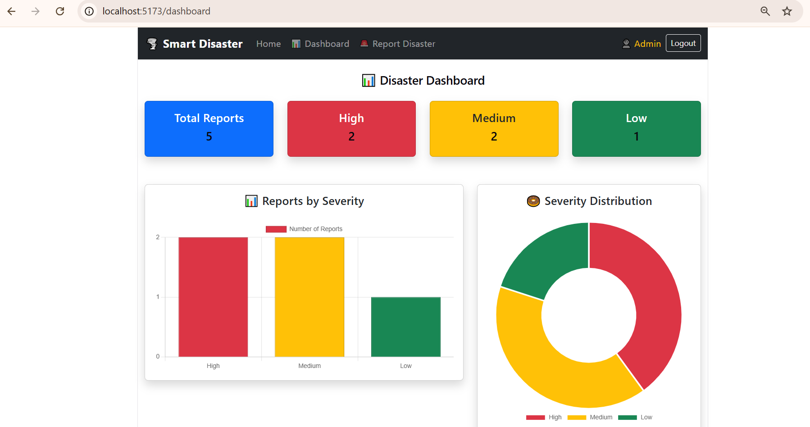
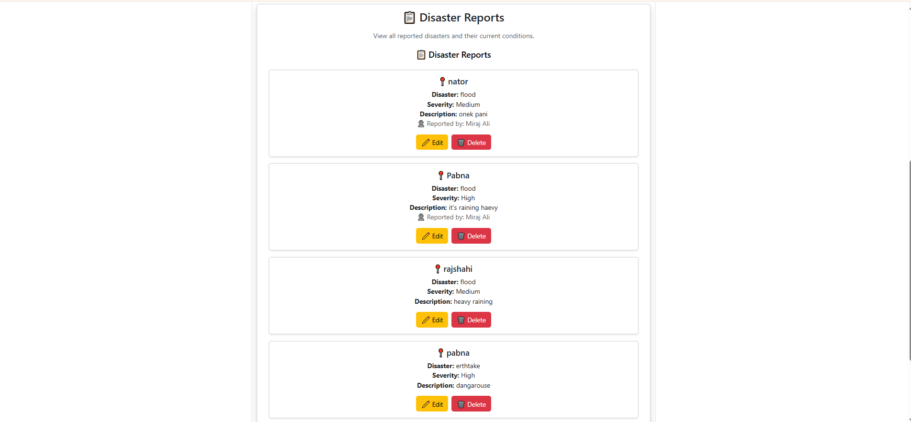

# 🌪️ Smart Disaster Reporting and Management System

A web-based disaster reporting and management system that allows users to report disasters and monitor disaster information through an interactive dashboard.

## 🌐 Live Demo

🔗 **Live Website:**  

---

## 📸 Project Screenshots

### 🏠 Home Page


### 📊 Dashboard



### 🚨 Disaster Reports



### 🔐 Login Page


### 🔐 Register Page


### 📝 Report Disaster


## ✨ Features

- 🌐 Public Home Page
- 📊 Disaster Dashboard
- 📋 View Disaster Reports
- 🚨 Submit Disaster Reports
- ✏️ Edit Reports
- 🗑️ Delete Reports
- 🔐 User Authentication
- 👤 User Registration and Login
- 👑 Admin Role Management
- 📈 Severity Statistics and Charts
- 🔒 Protected Report Management

---

## 👥 User Roles

### 👀 Visitor

- View Home Page
- View Dashboard
- View Disaster Reports

### 👤 Normal User

- Register and Login
- Submit Disaster Reports
- Edit own reports
- Delete own reports

### 👑 Admin

- View all reports
- Create reports
- Edit any report
- Delete any report
- Manage disaster information

---

## 🛠️ Technologies Used

### Frontend

- React.js
- Vite
- Bootstrap
- Axios
- React Router
- Chart.js

### Backend

- Node.js
- Express.js
- MongoDB
- Mongoose
- JWT Authentication

### Tools

- Git
- GitHub
- VS Code

---

## 📁 Project Structure

```text
SmartDisaster/
│
├── backend/
│   ├── controllers/
│   ├── middleware/
│   ├── models/
│   ├── routes/
│   └── server.js
│
├── frontend/
│   ├── src/
│   │   ├── components/
│   │   ├── pages/
│   │   ├── services/
│   │   └── context/
│   └── package.json
│
├── screenshots/
│   ├── home.png
│   ├── dashboard.png
│   ├── reports.png
│   ├── login.png
│   └── report.png
│
└── README.md
